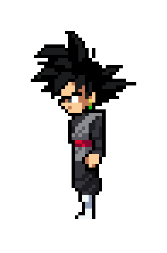

    

</h1>
<h1 align="center">Olá, eu sou o Enzo 😄</h1>
<h4 align="center">Sou estudante de Desenvolvimento de Software Multiplataforma na FATEC e amo Dragon Ball!🐉💜</h4>
 
 <h2 align="left">Sobre mim</h2>

<h4 align="left">🟣 Movido por desafios e pelo desejo constante de aprender, encontrei na tecnologia um universo onde posso unir <strong>lógica, criatividade e resolução de problemas</strong>. Programação, para mim, não é só escrever código, mas <strong>criar soluções que fazem a diferença</strong>.</h4>

<h4 align="left">🟣 Atualmente, estudo <strong>Desenvolvimento de Software Multiplataforma</strong>, explorando linguagens como <strong>JavaScript, Python e Java</strong>, além de conceitos fundamentais de <strong>banco de dados e desenvolvimento fullstack</strong>. Gosto de entender como as coisas funcionam e <strong>otimizar processos para torná-los mais eficientes</strong>.</h4>

<h4 align="left">🟣 Acredito que o aprendizado é contínuo e que <strong>compartilhar conhecimento e se desafiar sempre são as melhores formas de crescer</strong>. Vamos construir algo incrível juntos? 🚀</h4>

<h3 align="center">📚 Linguagens e ferramentas que eu já usei </h3>

 

     
     
     

<!--
**EnzoRibeir/EnzoRibeir** is a ✨ _special_ ✨ repository because its `README.md` (this file) appears on your GitHub profile.

Here are some ideas to get you started:

- 🔭 I’m currently working on ...
- 🌱 I’m currently learning ...
- 👯 I’m looking to collaborate on ...
- 🤔 I’m looking for help with ...
- 💬 Ask me about ...
- 📫 How to reach me: ...
- 😄 Pronouns: ...
- ⚡ Fun fact: ...
-->
